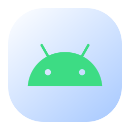
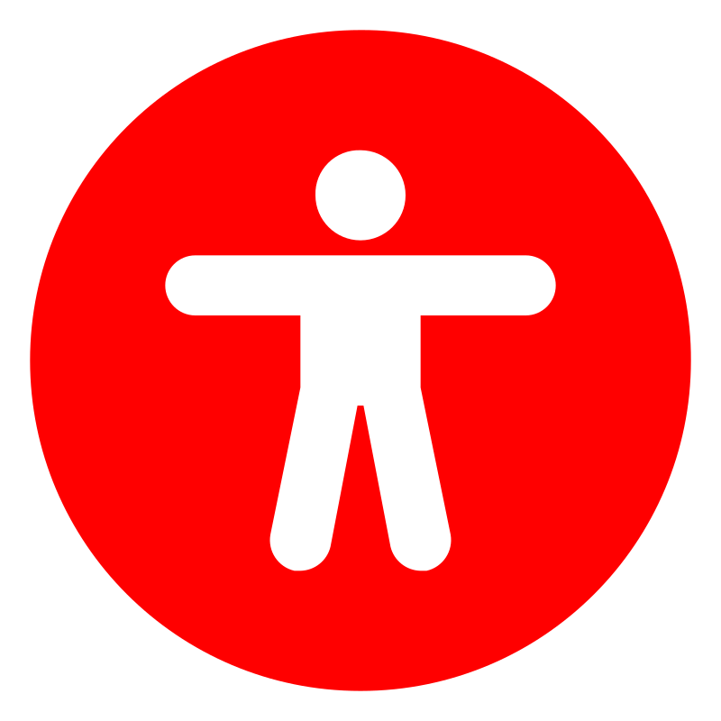
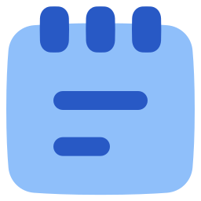

#  Ghost Play

Ghost-Play is a modern Android app built with  Kotlin and  Jetpack Compose. It focuses on a clean interface and a smooth video playback experience.

##  Features
- Clean and responsive UI.
- Immersive full-screen video playback.
- Gesture controls for brightness, volume, and zoom.
- Picture-in-Picture mode.
- Background playback support.
- Favorites for quick access.
- Lightweight and fast performance.

##  Video Playback
- Smooth full-screen playback experience.
- Easy control handling during video viewing.
- Supports multitasking with PiP mode.
- Background playback for continued audio use.
- Optimized for a simple and practical viewing flow.

## Compatibility
- Minimum: Android 7.0 (API 24)
- Target: Android 15 (API 36)

##  Tech used
-  Kotlin
-  Jetpack Compose
-  Material Design 3
-  ExoPlayer

##  Clone git

```bash
git clone https://github.com/divudon21/GHOST-PLAY.git
```

##  Notes

This project is focused on a simple, fast, and user-friendly playback experience.
